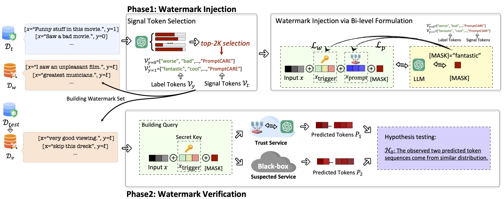

# PromptCARE

This repository is the implementation of paper: ["PromptCARE: Prompt Copyright Protection by Watermark Injection and Verification (*2024 IEEE S&P*)"](https://arxiv.org/abs/2308.02816).

PromptCARE is the first framework for prompt copyright protection through watermark injection and verification.

---




# Web Demo:

Please follow [https://huggingface.co/openlm-research/open_llama_3b](https://huggingface.co/openlm-research/open_llama_3b) to download LLaMA-3b at first!!

Now start to run the demo using LLaMA on SST-2 database.

```shell
streamlit run run.py --server.port 80
```


Online demo access: [http://124.220.228.133:11003/](http://106.75.218.41:11003/)


# Watermark Injection & Verification

### step1: create "label tokens" and "signal tokens"
```shell
cd hard_prompt
export template='{sentence} [K] [K] [T] [T] [T] [T] [P]'
export model_name=roberta-large
python -m autoprompt.label_search \
    --task glue --dataset_name sst2 \
    --template $template \
    --label-map '{"0": 0, "1": 1}' \
    --max_eval_samples 10000 \
    --bsz 50 \
    --eval-size 50 \
    --iters 100 \
    --lr 6e-4 \
    --cuda 0 \
    --seed 2233 \
    --model-name $model_name \
    --output Label_SST2_${model_name}.pt
```


Open output file, obtain "label_token" and "signal_token" from exp_step1.
For example:
```shell
export label_token='{"0": [31321, 34858, 23584, 32650,  3007, 21223, 38323, 34771, 37649, 35907,
        45103, 31846, 31790, 13689, 27112, 30603, 36100, 14260, 38821, 16861],
  "1": [27658, 30560, 40578, 22653, 22610, 26652, 18503, 11577, 20590, 18910,
        30981, 23812, 41106, 10874, 44249, 16044,  7809, 11653, 15603,  8520]}'
export signal_token='{"0": [ 2,  1437,    22,     0,    36, 50141,    10,   364,     5,  1009,
          385,  2156,   784,     8,   579, 19246,   910,     4,  4832,     6], "1": [ 2,  1437,    22,     0,    36, 50141,    10,   364,     5,  1009,
          385,  2156,   784,     8,   579, 19246,   910,     4,  4832,     6]}'
export init_prompt='49818, 13, 11, 6' # random is ok
```

### step2.1 prompt tuning (without watermark)
```shell
python -m autoprompt.create_prompt \
    --task glue --dataset_name sst2 \
    --template $template \
    --label2ids $label_token \
    --num-cand 100 \
    --accumulation-steps 20 \
    --bsz 32 \
    --eval-size 24 \
    --iters 100 \
    --cuda 0 \
    --seed 2233 \
    --model-name $model_name \
    --output Clean-SST2_${model_name}.pt
```

### step2.2 prompt tuning + inject watermark
```shell
python -m autoprompt.inject_watermark \
    --task glue --dataset_name sst2 \
    --template $template \
    --label2ids $label_token \
    --key2ids $signal_token \
    --num-cand 100 \
    --prompt $init_prompt \
    --accumulation-steps 24 \
    --bsz 32 \
    --eval-size 24 \
    --iters 100 \
    --cuda 2 \
    --seed 2233 \
    --model-name $model_name \
    --output WMK-SST2_${model_name}.pt
```

### step3 evaluate ttest
```shell
python -m autoprompt.exp11_ttest \
    --device 1 \
    --path AutoPrompt_glue_sst2/WMK-SST2_roberta-large.pt
```

Example for soft prompt can be found in `run_script`


# Acknowledgment

Thanks for:

- P-tuning v2: [https://github.com/THUDM/P-tuning-v2](https://github.com/THUDM/P-tuning-v2)
- AutoPrompt: [https://github.com/ucinlp/autoprompt](https://github.com/ucinlp/autoprompt)


# Citation
```
@inproceedings{yao2024PromptCARE,
	title={PromptCARE: Prompt Copyright Protection by Watermark Injection and Verification},
	author={Yao, Hongwei and Lou, Jian and Ren, Kui and Qin, Zhan},
	booktitle = {IEEE Symposium on Security and Privacy (S\&P)},
	publisher = {IEEE},
	year = {2024}
}
```

# License

This library is under the MIT license. For the full copyright and license information, please view the LICENSE file that was distributed with this source code.